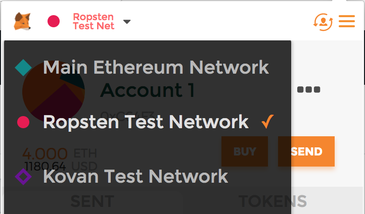
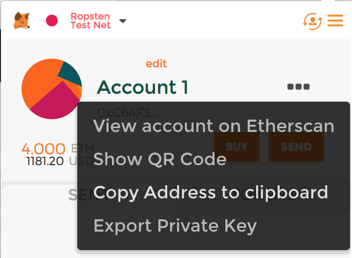
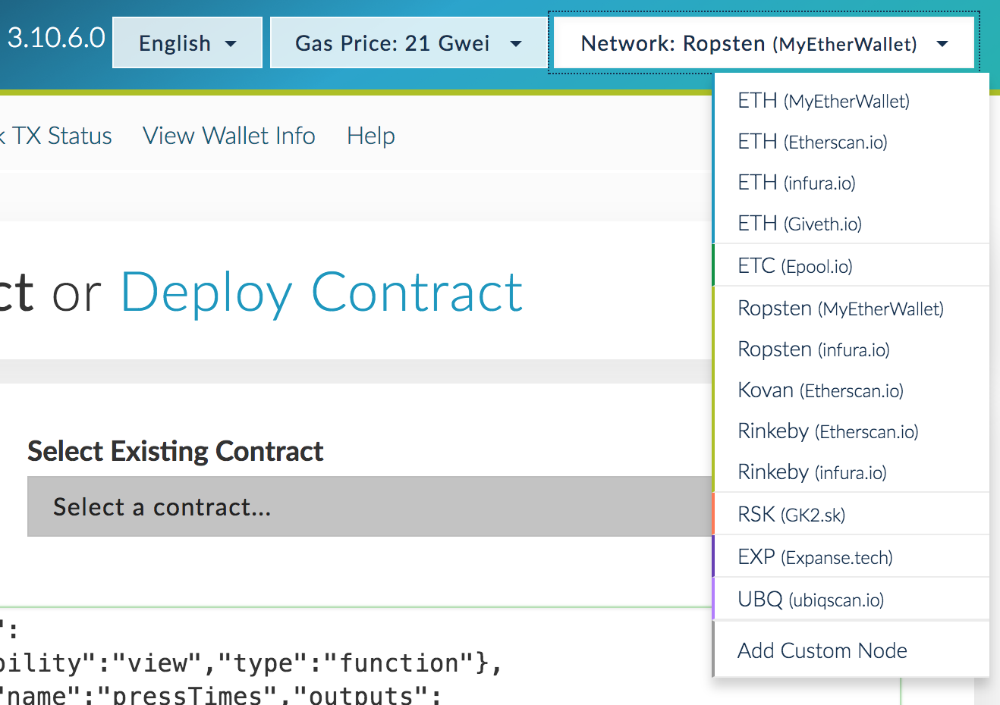
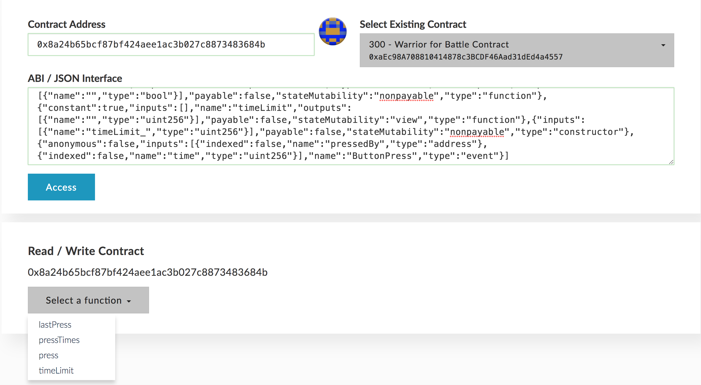
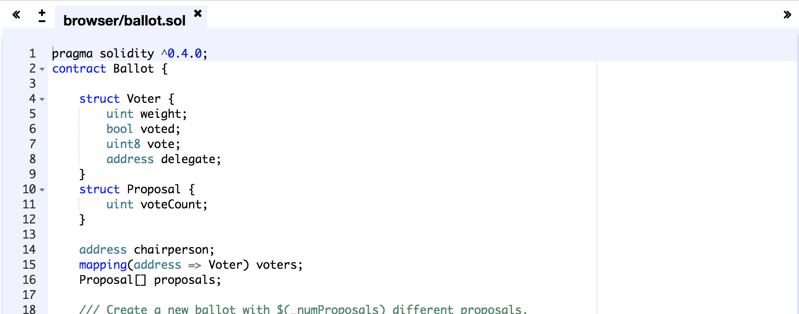
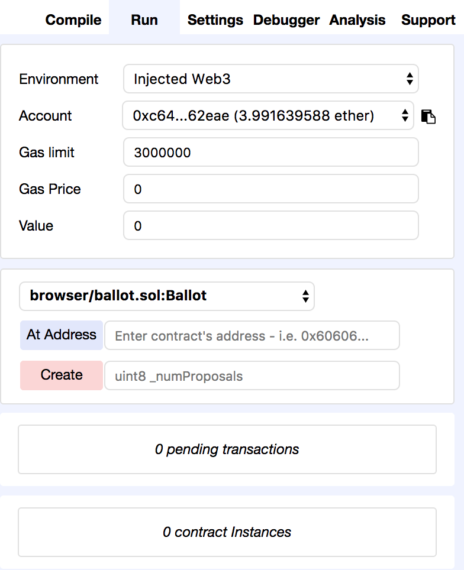
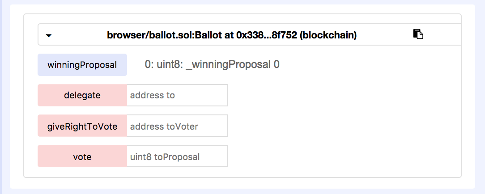

# Getting started with Ethereum

This is a introductory guide to programming decentralized applications on the Ethereum blockchain. Decentralized applications (dApps) are applications where the backend logic runs on an open, decentralized execution platform ([Ethereum](https://www.ethereum.org/)) and all data is stored in an open, distributed database or file store ([IPFS](https://ipfs.io/)). dApps typically look like regular GUI applications to end users, but the users do not need to trust a third party (eg. Google, Facebook, PayPal, E Corp, etc.) to store the data or perform the expected backend computations. Here is some additional reading material on dApps:

- [App Coins and the dawn of the Decentralized Business Model](https://medium.com/the-coinbase-blog/app-coins-and-the-dawn-of-the-decentralized-business-model-8b8c951e734f#.c9nhnhoui)
- [A beginner's guide to Ethereum](https://blog.coinbase.com/a-beginners-guide-to-ethereum-46dd486ceecf)
- [Getting up to speed on Ethereum](https://medium.com/@mattcondon/getting-up-to-speed-on-ethereum-63ed28821bbe)

This guide is meant to provide a hands-on introduction to some common tools and serve as a starting point for anyone interested in dabbling with decentralized applications. While the guide demonstrates how to interact with the Ethereum blockchain, it does *not* explain what blockchains are nor how they work. Note also that there are lots of different tools one can use to develop Ethereum applications, and in this guide I am recommending just one possible selection of those tools suitable for beginners.

## Prerequisites

In order to program dApps, you should be familiar with the following:

- JavaScript/HTML/CSS

You are not expected to have a prior understanding of Ethereum or blockchains generally.

## Getting started

### Create an Ethereum account with Metamask

The first thing you need is an Ethereum wallet. A wallet is the software that connects you to the Ethereum network and manages your accounts. The most basic thing an account can do is store, send, and receive ether (ETH), the native currency of the Ethereum network, but as we will see soon it can do much more. The way accounts work is that they have a [private key](https://en.wikipedia.org/wiki/Public-key_cryptography) which is kept secret and a public address which you can share with others. This is kind of like a mathematically generated username and password, where anyone can send money to someone else's account using their public address (eg. 0xC64F327DbDeA533f3930D99C93e84e0a14662eae), but only the owner of the private key can spend the money.

I recommend using the [Metamask](https://metamask.io/) Chrome extension as an easy wallet to use. Metamask runs as a browser extension, so you can develop and browse dApps right in your browser without having to install anything else.

When you launch Metamask and create a new vault, it will prompt you to enter a password and backup a string of random words. In this guide, I am only recommending you use Metamask for test (fake) ether, so you do not need to be overly concerned with the security of these items (ie. throw them in a password manager if you have one). **If, however, you later choose to purchase ETH and store it in Metamask, you should be very careful with the security of this password and seed. While Metamask is a great tool for Ethereum development and casual usage of dApps, I cannot recommend Metamask as the best wallet for storing a large amount of ether.**

### Get some testnet ETH

Live dApps require the currency ETH in order to take certain actions. ETH is a digital currency that can be transferred on the Ethereum blockchain and has [real world value](https://coinmarketcap.com/currencies/ethereum/). Since we are just getting our feet wet right now, instead of buying ETH we are going to interact with the Ethereum test network, called Ropsten. The test network runs with the exact same rules and code as the main network, but the native currency is not valuable and can be obtained for free.

First, go to your Metamask wallet and in the top left corner, make sure you are connected to the Ropsten Test Network.

Now click to copy your account's address.

Next, navigate to [http://faucet.ropsten.be:3001/](http://faucet.ropsten.be:3001/) where you can enter the address to request testnet ETH.

Soon afterward, the balance of your Metamask account should increase by 3 ETH. Note that if you switch Metamask back to the main network, the balance is still 0; the account only receives money on the test network.

One interesting and defining characteristic of blockchains is that transactions are completely public. You can even see the transaction that the faucet sent to your account by going to the [Etherscan block explorer](https://ropsten.etherscan.io/) and searching for your address in the search bar.

## Using a dApp

Now we're ready to actually use a dApp. I have deployed one [here](https://jimpo.github.io/ethereum-development-guide/the-button/) inspired by Reddit's [The Button](https://en.wikipedia.org/wiki/The_Button_(Reddit)) experiment.

The idea is that there is a countdown timer and every time someone presses the button, the timer resets. If the timer reaches 0, however, the button is frozen for the rest of time and the experiment ends. Each Ethereum account may only press the button once, and depending on how close the timer is to 0 when a user presses it, he or she will be rewarded with their screen showing a certain color, which translates directly into street cred. So go ahead, try it out.

You'll notice that when you press the button, Metamask pops up asking you if you will authorize a transaction. This is because the way that you submit your button press to the blockchain is with a transaction.

The frontend of the application is just regular HTML, CSS, and JavaScript, so a dApp can look and feel just like a regular web application. Instead of connecting to a centralized server, though, the web page uses Metamask to communicate with the blockchain. Pretty cool, huh?

### A deeper look at contracts

Let's dive into what is happening on the "backend". The web frontend is communicating with a piece of code that lives on the blockchain called a *smart contract*. When you pressed the button and submitted a transaction, you actually called a method on the smart contract.

While some contracts have a custom frontend like this one, we can use another tool called MyEtherWallet to interact with contracts directly. Go to [this page](https://www.myetherwallet.com/#contracts).

First, on the top right hand side of the page, change the network to Ropsten, the test network.

Next, in order to specifiy to MyEtherWallet which contract you want to look at, you need to provide an address (just like an account address) and an interface specification called an ABI. You can get this on the Button page, by toggling the "Show contract address and ABI" link. Copy them over and paste them into MyEtherWallet and click "Access". The last thing you need to do is select that you are using Metamask.

You should now see a drop down with a list of methods you can call. For example, if you select "pressTimes", copy your Metamask account address into the box, and click "Read", it will tell you how many seconds your press was from the one before it. You can even try executing the "press" method.

### The source code

In case you want to see the code for The Button, it is all [right here](https://github.com/jimpo/ethereum-development-guide/tree/master/the-button).

## Developing

### Writing a smart contract

We will start by writing the smart contract. Ethereum smart contracts are written in a special purpose programming language called Solidity. Solidity looks kind of like JavaScript, but has some quirks that you need to get used to. The best way to learn Solidity is to read through the [online documentation](http://solidity.readthedocs.io/en/develop/introduction-to-smart-contracts.html). You can skip the "Installing Solidity" section for now though, as we will be doing all contract development in the browser.

There is an in-browser Solidity IDE called [Remix](https://remix.ethereum.org). The IDE is preloaded with an example voting application when you first visit, which we will deploy.

To deploy it, click the "Run" tab on the upper right hand side of the screen. The right sidebar should now look like this:

Now enter 2 into the text field next to the red create button. This is going to create a new Ethereum transaction containing the compiled code for the contract and invoke the constructor with a value of 2. Metamask will prompt you to accept this transaction and let you know how much you have to pay to deploy the code.

Now we have to wait about 30s for the code to get accepted on the blockchain. Once it is, you will see a new autogenerated interface appear in the right sidebar for interacting with the contract.

The blue buttons allow you to call read-only methods on the contract, which don't cost anything, whereas the red buttons are read-write methods that make an Ethereum transaction and do cost ETH.

Now that the contract is deployed, you can use MyEtherWallet to interact with it as well. If you go back to the [MyEtherWallet Contracts tab](https://www.myetherwallet.com/#contracts) you will see that we need to enter the contract address and the ABI. To get the contract address from the Remix UI, click the copy button next to the contract interface on the right sidebar.

To get the ABI in Remix, you need to click the "Details" button on the "Compile" tab. You will see a big model appear with an ABI section. Click the copy button next to it and paste it into the field in MyEtherWallet.
